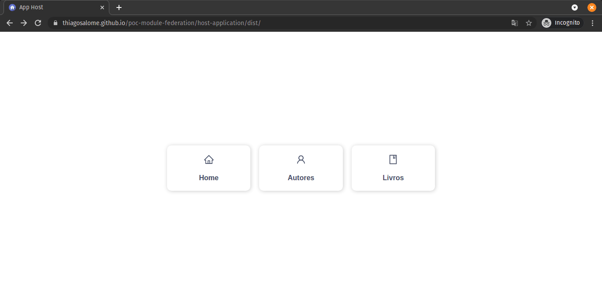

<!-- Logo -->
<p align="center">
  
</p>

<!-- Badges -->
<p align="center">
  <a href="https://thiagosalome.github.io/poc-module-federation/host-application/dist/" target="_blank">
  
  
  
  
</p>

<!-- Indice-->
<p align="center">
 <a href="#computer-sobre">Sobre</a> •
 <a href="#gear-funcionalidades">Funcionalidades</a> •
 <a href="#wrench-tecnologias-utilizadas">Tecnologias</a> •
 <a href="#movie_camera-preview">Preview</a> •
 <a href="#rocket-executando-o-projeto">Executando</a> •
 <a href="#memo-licença">Licença</a>
</p>

## :computer: Sobre

Essa prova de conceito do **Module Federation** foi um projeto criado com o intuito de aprofundar meus conhecimentos na nova feature de mesmo nome lançada junto com a versão 5 do Webpack. É interessante para projetos que envolvem a criação de micro frontends. Caso tenha interesse em saber mais, [aqui está o link da documentação](https://webpack.js.org/concepts/module-federation/).

Nesse projeto eu criei dois micro frontends, o [authors-application](https://github.com/thiagosalome/poc-module-federation/tree/main/authors-application), e o [books-application](https://github.com/thiagosalome/poc-module-federation/tree/main/books-application). Ambos consomem os dados do [Faker API](https://fakerapi.it/), uma API gratuita responsável por gerar dados fake. O [host-application](https://github.com/thiagosalome/poc-module-federation/tree/main/host-application) é responsável por consumir esses dois micro frontends e renderizá-los em tela.

## :gear: Funcionalidades

- [x] Listagem de autores
- [x] Listagem de livros

## :wrench: Tecnologias Utilizadas

<table>
  <tbody>
    <tr>
      <td align="center">
        
        <p>Webpack</p>
      </td>
      <td align="center">
        
        <p>HTML</p>
      </td>
      <td align="center">
        
        <p>Javascript</p>
      </td>
      <td align="center">
        
        <p>Typescript</p>
      </td>
      <td align="center">
        
        <p>React</p>
      </td>
      <td align="center">
        
        <p>Chakra UI</p>
      </td>
    </tr>
  </tbody>
</table>

## :movie_camera: Preview

### Web



## :rocket: Executando o projeto

### Pré-requisitos

Para executar o projeto é necessário ter instalado as seguintes ferramentas:

<table>
  <tbody>
    <tr>
      <td align="center">
        <a href='https://git-scm.com/downloads' target='_blank'>
          
          <p>GIT</p>
        </a>
      </td>
      <td>
        <a href='https://git-scm.com/downloads' target='_blank'>
          
          <p>Node.js</p>
        </a>
      </td>
    </tr>
  </tbody>
</table>

### Baixando e configurando aplicação

```bash
# Clone este repositório
$ git clone https://github.com/thiagosalome/poc-module-federation

# Acesse a pasta do projeto no seu terminal/cmd
$ cd poc-module-federation

# Instale as dependências
$ npm install
```

### Rodando aplicação

```bash
# Execute a aplicação em modo de desenvolvimento
$ npm run start

# A aplicação será aberta na porta:3000 - acesse http://localhost:3000
```

## :memo: Licença

Este projeto esta sobe a licença [MIT](./LICENCE).
